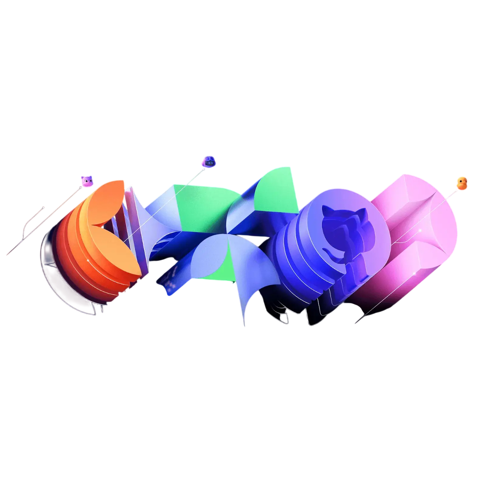

<h1 align="center">Hi, I’m Kamruzzaman</h1>
<h3 align="center">Front-End Web Developer</h3>

 I am a front-end web developer with a strong interest in building clean, responsive, and user-friendly web interfaces. I enjoy learning modern web technologies, developing real-world projects, and continuously improving my skills. My focus is on writing maintainable code and delivering a smooth, high-quality user experience. 

## 💫

- 🔭 I’m currently working on front-end projects

  
- 🌱 I’m currently learning modern web technologies

  
- 👯 I’m looking to collaborate on open-source projects

  
- 💬 Ask me about HTML, CSS, JavaScript, and React

  
- 📫 How to reach me: [kamruzzamankamrul24158@gmail.com](mailto:kamruzzamankamrul24158@gmail.com)
  
- ⚡ Fun fact: I enjoy playing games and staying active
  
 <h3 align="left"> 🌐 Connect with me:</h3>

## 🛠️ Technologies & Tools

## 📊 GitHub Stats:
 
 

